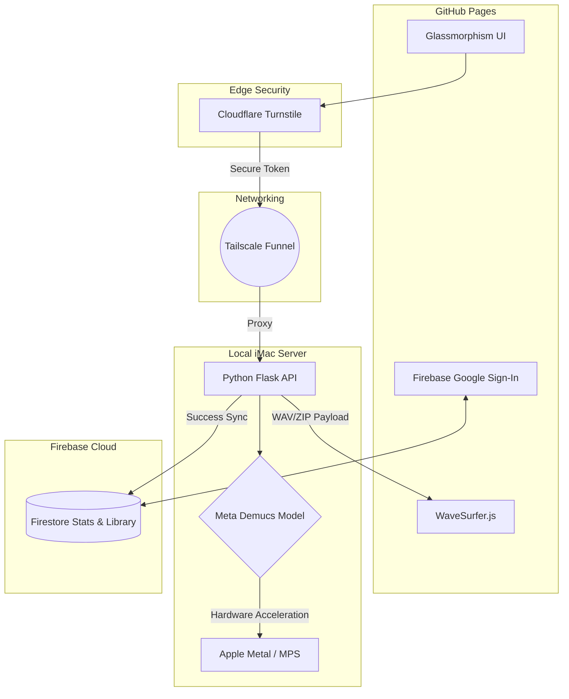
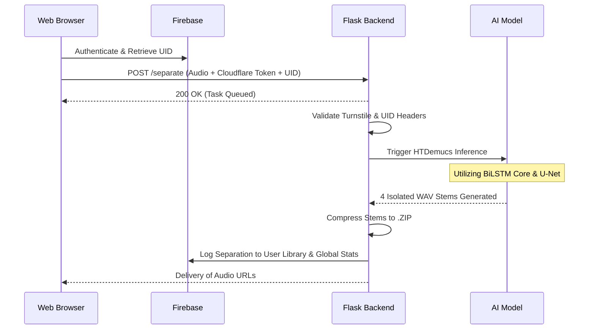

# 🎵 Advanced Audio Stem Separator

[](https://vicsanity623.github.io)
[](https://vicsanity623.github.io)
[](https://github.com/facebookresearch/demucs)

A professional, **100% free**, web-based application that isolates audio tracks into individual stems (**Vocals, Drums, Bass, Other**) utilizing the state-of-the-art **Meta Demucs** AI engine. 

Designed to bypass the corporate paywalls of services like Lala.ai or Splitter.ai, this platform operates entirely on volunteer, self-hosted hardware with **no file-length restrictions** and **no pay-per-minute** costs.

🔗 **Try it now:** https://vicsanity623.github.io/audioStems

---

## ✨ Core Features

- **🚫 No Paywalls & Unlimited Length**: Upload full-length tracks (FLAC, WAV, MP3) without artificial pay-per-minute throttles.
- **🔐 Google Authentication**: Secure sign-in to track your lifetime processing statistics and keep bad actors out.
- **📚 Studio Library**: A beautiful glassmorphism browser tracking your most recent AI separations.
- **📈 Global Analytics**: Cyberpunk-themed, live-updating line graphs (via Chart.js) showing the global processing heartbeat.
- **🛡️ Enterprise Security**: Integrated **Cloudflare Turnstile** bot-protection to prevent network abuse.
- **🌊 Interactive Player**: Real-time waveform visualization using **WaveSurfer.js** with targeted "Solo Mode" playback and 1-click `.ZIP` downloads.

---

## 🏗️ Architecture & Infrastructure

This platform is a **headless web application** bridging a static frontend to a private machine-learning pipeline via zero-trust networking.

### Infrastructure Topology



### The Inference Pipeline
When an audio file is submitted, it enters a rigorous, hardware-accelerated processing pipeline:



---

## 🧠 The Self-Hosted Philosophy

While the Demucs algorithm is open-source, its computational demands are incredibly high. Most web platforms take this open-source gift and immediately place it behind paywalls—throttling processing speeds and compressing the audio output quality purely for profit.

**This platform operates differently.** 
By leveraging a secure **Tailscale Funnel** tunnel, your audio request is securely routed from GitHub Pages directly to a private, Intel-based iMac. 
- The audio is processed locally in a high-precision 32-bit floating-point environment.
- The output is kept in pristine, studio-grade `WAV` format.
- Output files are automatically wiped every 24 hours to ensure 100% data privacy.

This is a demonstration of how consumer hardware can be securely bridged to the global web to provide world-class, GPU-accelerated AI services without corporate compromise.

---

## ⚠️ Performance & Usage Limitations

This service runs on **personal hardware**, not an autoscaling AWS server farm.

- **Queueing:** The backend utilizes a strict First-In-First-Out (FIFO) queue. If multiple users hit the server simultaneously, your track will be queued.
- **Hardware Profile:** Inference is automatically optimized for the host hardware (Apple Metal `mps`, Nvidia `cuda`, or fallback `cpu`). Average processing time is ~2–3 minutes per track.
- **Uptime:** Because this relies on a physical iMac and a residential network tunnel, uptime is strictly **best-effort**.

---

## 📜 Legal & Usage Policy

⚠️ **EDUCATIONAL AND PROFESSIONAL USE ONLY**

This tool is strictly intended for **educational, research, forensic, and professional production use** on content you own or have explicit permission to modify.

1. ✅ You **must own** the rights to the uploaded audio.
2. ❌ Do **not upload copyrighted material** without explicit permission from the rights holder.
3. ✅ You are **fully responsible** for how the separated stems are utilized post-download.

> **Privacy Notice:** We do not permanently store user audio. All raw files and generated stems are transient and are wiped from the server every 24 hours. Your Firebase profile simply stores a history string of your separated file names.

---

## 🙏 Acknowledgments & Dependencies

This project stands on the shoulders of giants. A massive thank you to the Meta Research team for open-sourcing the Demucs engine:

```bibtex
@article{defossez2021hybrid,
  title={Hybrid Spectrogram and Waveform Source Separation},
  author={Défossez, Alexandre},
  journal={arXiv preprint arXiv:2111.03600},
  year={2021}
}
```

**Tech Stack:**
- [Tailscale Funnel](https://tailscale.com) (Reverse Proxy)
- [Firebase Auth & Firestore](https://firebase.google.com) (Database & Security)
- [Cloudflare Turnstile](https://cloudflare.com) (Bot Mitigation)
- [Chart.js](https://chartjs.org) (Data Visualization)
- [WaveSurfer.js](https://wavesurfer-js.org) (Audio Player)
- [TailwindCSS](https://tailwindcss.com) (UI Styling)
